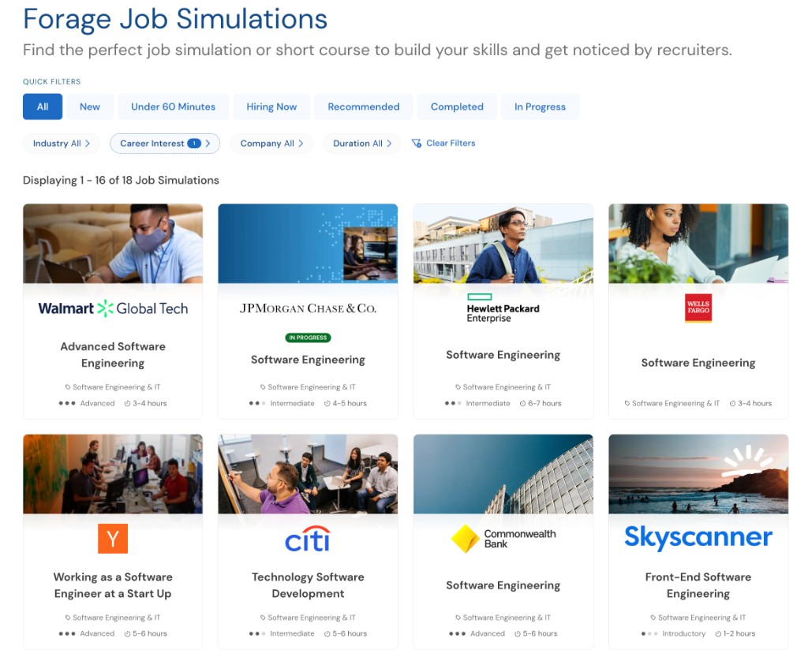

# Job Simulations

This repo is where I keep my work from virtual job simulations on [Forage](https://www.theforage.com). Companies partnering with Forage publish a small set of tasks designed to mirror real day-to-day work on their teams. Not a full internship: typically a few hours, self-paced, with guidance from company staff and a certificate at the end. I did these as my first real peek at what industry work looks like, before internships or full-time roles.

## J.P. Morgan

### [Software Engineering (Perspective)](./jpmc/swe-perspective/)

This job sim involved writing a program to support a trader's workflow. The goal was to help the trader spot when the relationship between two correlated stocks. I built the dashboard tooling behind that across three tasks.

1. **Stock price feed** — Fixed a Python client to pull bid/ask data and compute price ratios.
2. **Perspective integration** — Connected JPMC's open-source [Perspective](https://perspective.finos.org/) library in React for streaming, live-updating charts.
3. **Trader dashboard** — Reworked the view to track ratios over time, with bounds and alerts when they drift.

Each task had its own fork (Forage's setup). My certificate and links to the code are in the folder. [View on Forage ↗](https://www.theforage.com/virtual-internships/prototype/R5iK7HMxJGBgaSbvk/JP-Morgan-Banking-Technology-Virtual-Program)

### [Quantitative Research](./jpmc/quant/)

Two of four tasks from JPMC's quant research sim. I modeled natural gas prices and built a prototype pricer for storage contracts on top of those estimates.

1. **Price forecasting** — Fit a SARIMA model on historical data; given a date, it returns a price estimate (including about a year forward).
2. **Contract pricing** — Priced storage contracts from injection/withdrawal dates, volumes, capacity limits, and storage costs, all using the Task 1 forecast.

Code, data, and write-up in this folder. [View on Forage ↗](https://www.theforage.com/simulations/jpmorgan/quantitative-research-11oc)

### [Agile Methodologies](./jpmc/agile/)

Six modules on how JPMC applies Scrum. No code here; I kept my quiz notes in each task folder and my completion certificate in the program README.

1. **Introduction to Agile** — Manifesto, principles, Agile vs. Waterfall.
2. **Scrum at JPMC** — Roles, ceremonies, artifacts.
3. **User stories** — Writing stories, INVEST, acceptance criteria.
4. **Backlog refinement** — Prioritization, grooming, getting stories sprint-ready.
5. **Daily standups** — Format, purpose, common pitfalls.
6. **Sprint reviews and retrospectives** — Demoing work, gathering feedback, team improvement.

[View on Forage ↗](https://www.theforage.com/virtual-experience/5QiaMtZ4k8ngYKn4D/j-p-morgan/agile-v1fq/intro-to-agile)

---

These programs are hosted on [Forage](https://www.theforage.com).

  

