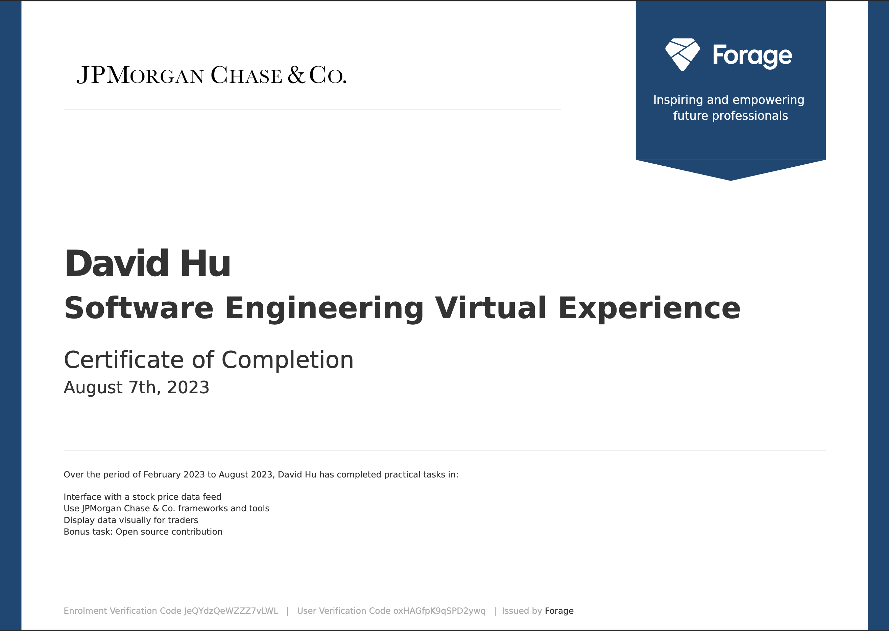
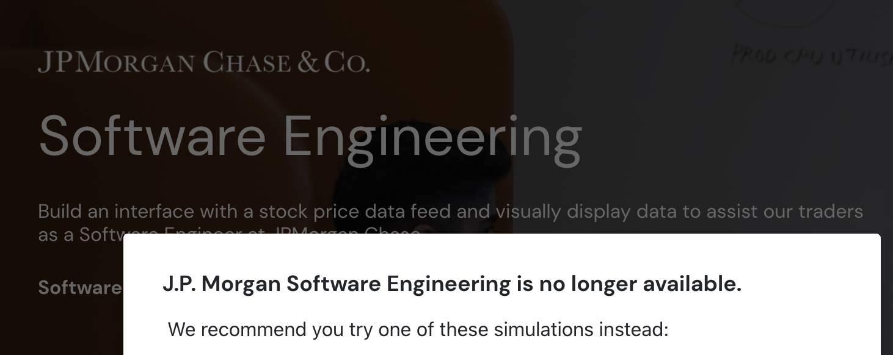

# JPMC Advanced Software Engineering Job Simulation

This project showcases my completion of the **Advanced Software Engineering Virtual Experience** designed by **J.P. Morgan Chase & Co.** and hosted on Forage.

Each task is maintained in a separate public repository to preserve original forks and contributions from JPMC’s official starter templates. These projects simulate how engineers at JPMC use live data to support trading decisions.

While I completed this experience early in my journey, I’ve since revisited the code to clean it up, modernize the structure, and improve usability.

> 🏦 Designed by real engineers at J.P. Morgan Chase  
> ✅ Verified via official certificate (see below)

  

> 🛑 This experience is no longer available on Forage.  
> I’ve preserved a screenshot below for reference to demonstrate its original branding:

  

## 🔗 Tasks

- [Task 1 – Interface with the Stock Price Data Feed](https://github.com/dhu2022-dev/jpmc-swe-task1)
- [Task 2 – Use JPMorgan Chase’s frameworks and tools (Perspective)](https://github.com/dhu2022-dev/jpmc-swe-task2)
- [Task 3 – Display data visually for Traders](https://github.com/dhu2022-dev/jpmc-swe-task3)

> 📌 These tasks were intentionally left in their original forked repositories to reflect their source and ensure public verification of participation.

## 📝 What I Learned

- Interfacing with real-time data feeds via REST APIs
- Visualizing dynamic financial data using Perspective
- Integrating full-stack workflows (Python backend + React frontend)
- Following GitHub pull request workflows across tasks
