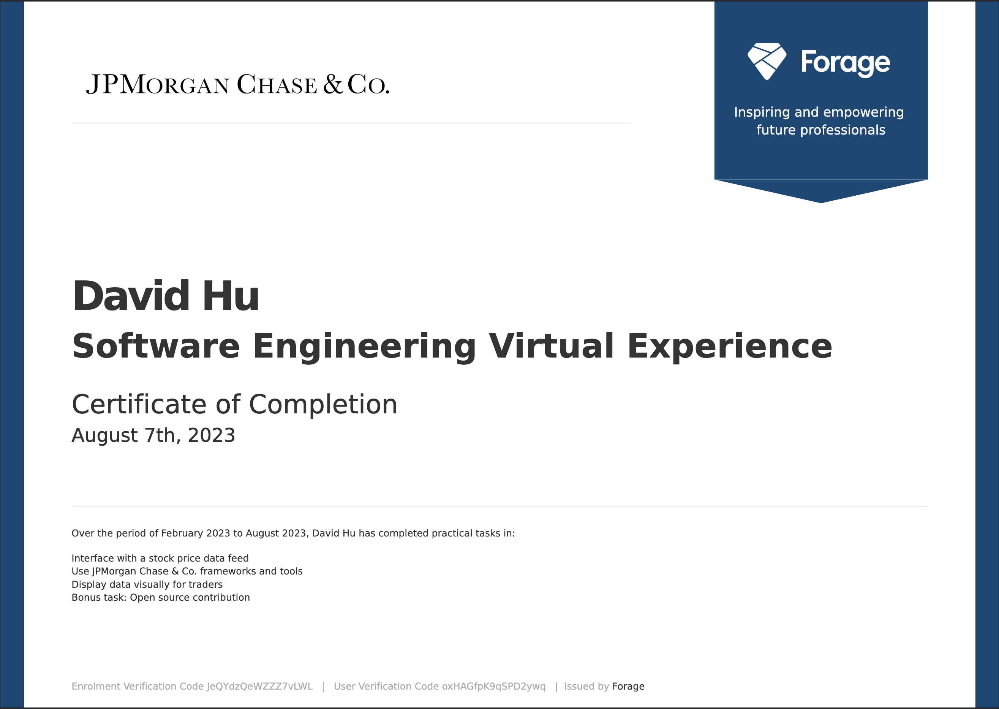

# Software Engineering (Perspective)

Three-task [Forage](https://www.theforage.com/virtual-internships/prototype/R5iK7HMxJGBgaSbvk/JP-Morgan-Banking-Technology-Virtual-Program) job sim: build dashboard tooling so a trader can watch two correlated stocks and spot when the relationship breaks. Forage required a separate fork per task, so the code lives in linked GitHub repos.

Task write-ups are below. Run instructions, screenshots, and source code are in the repos: [Task 1](https://github.com/dhu2022-dev/jpmc-swe-task1) · [Task 2](https://github.com/dhu2022-dev/jpmc-swe-task2) · [Task 3](https://github.com/dhu2022-dev/jpmc-swe-task3)

[← Job Simulations](../../README.md)

---

## Task 1: Stock price feed

**The task.** Run a Python server that serves mock bid/ask quotes for two stocks (`ABC` and `DEF`). Fix the broken client so it computes mid-prices from bid and ask, tracks both stocks, and prints their price ratio. [Official task on Forage ↗](https://www.theforage.com/modules/R5iK7HMxJGBgaSbvk/gtAhtcvke9AFCzqME)

**How I solved it.** Updated `getDataPoint` to average bid and ask, `getRatio` to divide the two mid-prices (with a zero check), and the main loop to store prices in a dict before computing the ratio. I also added a small HTML/CSS/JS page served from the same Python server so the quotes are visible in a browser, not just the terminal.

**Demo.** [Run instructions and screenshots →](https://github.com/dhu2022-dev/jpmc-swe-task1)

---

## Task 2: Perspective integration

**The task.** Hook up JPMC's open-source [Perspective](https://perspective.finos.org/) library in a React app fed by the Task 1 Python server. Fix duplicate rows in the table, poll the server every 100ms while streaming, and show a line chart of ask prices. [Official task on Forage ↗](https://www.theforage.com/modules/R5iK7HMxJGBgaSbvk/88AisH7iuw3L5N5ig)

**How I solved it.** In `App.tsx`, replaced the single fetch with a `setInterval` at 100ms that keeps requesting data until stopped. In `Graph.tsx`, stopped appending to state on each tick (which duplicated rows) and passed fresh server data straight into Perspective. Configured the viewer for `y_line` on `top_ask_price` pivoted by stock and timestamp.

**Demo.** [Run instructions and demo →](https://github.com/dhu2022-dev/jpmc-swe-task2)

---

## Task 3: Trader dashboard

**The task.** Rework the live chart to track the *ratio* between the two stocks (not raw prices), plot upper and lower bounds on that ratio, and alert when the ratio crosses them. [Official task on Forage ↗](https://www.theforage.com/modules/R5iK7HMxJGBgaSbvk/EbtbrgmwKbgqcXyGt)

**How I solved it.** Added `DataManipulator.ts` to compute mid-prices, the ratio, bounds (±2.5% around 1.0), and a `trigger_alert` flag when the ratio breaches. Updated `Graph.tsx` to feed one row per tick into Perspective and chart `ratio`, `upper_bound`, `lower_bound`, and `trigger_alert` as a `y_line` view over time.

**Demo.** [Run instructions and demo →](https://github.com/dhu2022-dev/jpmc-swe-task3) (same stack as Task 2)

---

## Certificate

  

[View on Forage ↗](https://www.theforage.com/virtual-internships/prototype/R5iK7HMxJGBgaSbvk/JP-Morgan-Banking-Technology-Virtual-Program)
